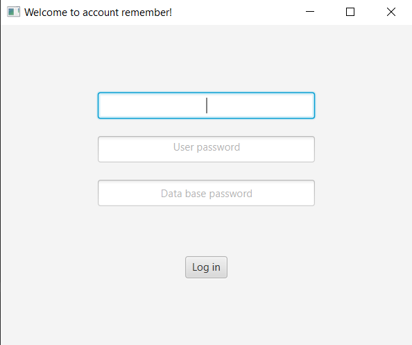
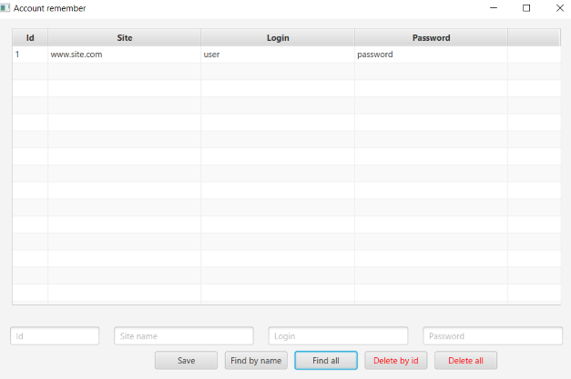

### Account remember

##### Информация о приложении:

- Простое оконное приложение для хранения логина и пароля от различных аккаунтов
- Используемые технологии: Java17, JavaFX, H2, SLF4J
- Хранит информацию во встроенной базе данных
  (создается в корне проекта / или меснонахождения jar файла. Там же хранится логирование действий)
- Пароль и база данных шифруется (AES)
- Есть бэкап дынных. Хранится в корневой папке юзера (~/DB.zip)
- Запуск из корня проекта:
    - mvn clean package
    - java -jar ./target/AccountRemember.jar

#### Интерфейс:

- Окно входа: логин и пароль к бд + пароль расшифровки бд. Если забыть данные для входа, то восстановить не получится)
  (по крайней мере я не знаю как расшифровать и лень делать форму востановления)

- Основное окно
    - Сохранить данные
    - Поиск по имени
    - Удаление по id
    - Показать или удалить все записи

